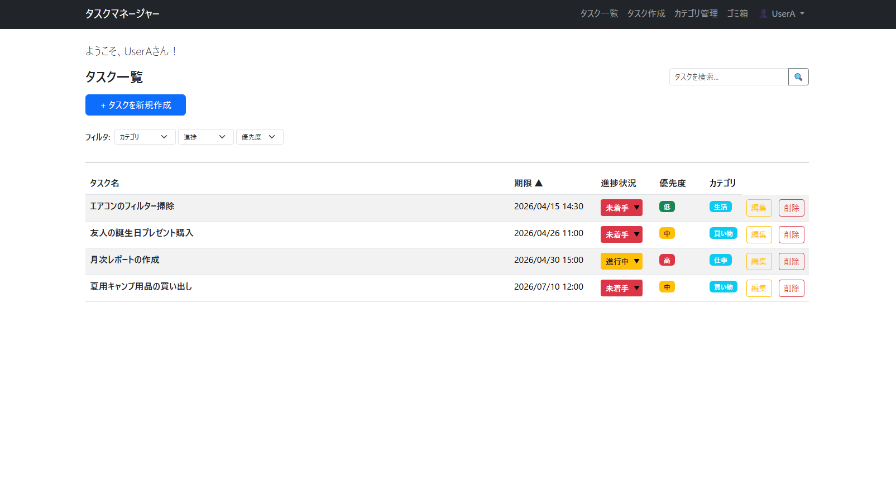
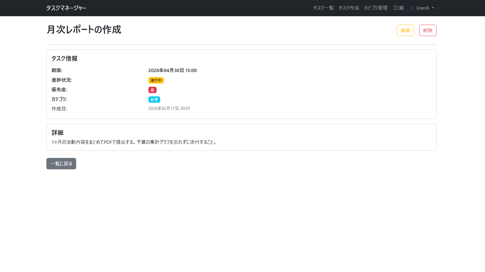
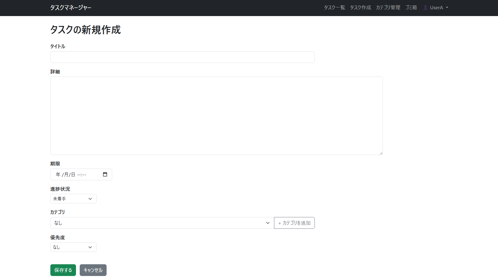
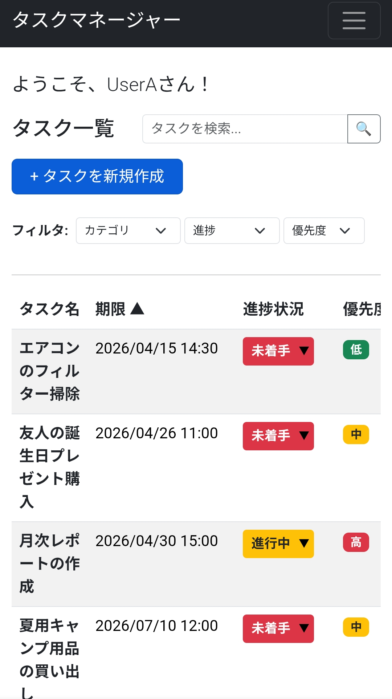

# Django タスク管理アプリケーション

このプロジェクトは、Djangoを使用して作成されたシンプルで直感的なタスク管理ツールです。
個人のタスクを効率的に管理し、進捗を可視化することを目的としています。

## ✨ 主な機能

- **タスクの管理**: 作成、編集、詳細表示、削除（論理削除）が可能です。
- **ステータス管理**: 「未着手」「進行中」「完了」のステータスを一覧から直接更新できます。
- **カテゴリ機能**: タスクをカテゴリごとに分類し、整理できます。
- **ゴミ箱・復元機能**: 削除したタスクは一度ゴミ箱に入り、そこから完全に削除するか、元のリストに復元するかを選択できます。
- **ユーザー認証**: サインアップ、ログイン、プロフィール編集、パスワード変更機能を完備しています。
- **レスポンシブデザイン**: PCだけでなく、スマートフォンからも快適に操作できるレイアウトを意識しています。

## 📸 スクリーンショット

| タスク一覧画面 | タスク詳細画面 |
| :---: | :---: |
|  |  |
| **タスク作成画面** | **スマートフォン表示** |
|  |  |

## 🛠 使用技術

- **バックエンド**: Python 3.13.9 / Django
- **フロントエンド**: HTML5 / CSS3 / JavaScript / Bootstrap 5
- **デプロイ**: Render

## 🚀 使い方・環境構築

### 1. Web上で確認する（Render）

以下のURLから、公開中のデモサイトを直接ご確認いただけます。  
URL:https://task-manager-app-ir2p.onrender.com

**デモ用アカウント:**

- **ユーザー名**: UserA
- **パスワード**: Pass0000

※ どなたでもログインして機能をお試しいただけます。

### 2. ローカル環境で実行する

開発環境でコードを確認・変更したい場合は、以下の手順で実行可能です。

1. **リポジトリをクローン**
   ```bash
   git clone [https://github.com/takeda-kaito/task_manager_app.git](https://github.com/takeda-kaito/task_manager_app.git)
   cd task_manager_app
   ```
